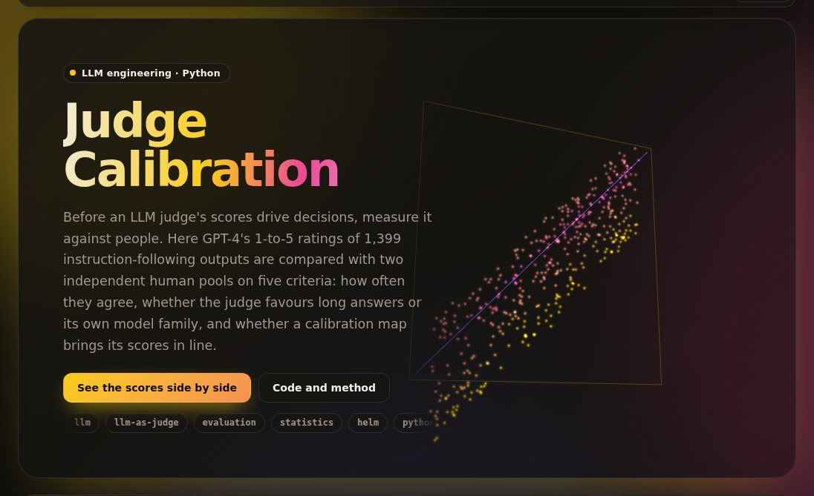

# judge-calibration

[](https://umer-78.github.io/judge-calibration/)

**Live demo:** https://umer-78.github.io/judge-calibration/ (the judge's scores against two human pools, per criterion)

How far can you trust an LLM judge? This repo measures GPT-4 as a judge against two pools of human raters on 1,399 real model outputs. It reports weighted kappa, three bias numbers and a calibration that holds up on raters it never saw. It also contains the judge itself: a rubric with every point defined, reason-before-score prompting, and a position-bias check.

The data is HELM Instruct. Outputs from GPT-4, GPT-3.5 Turbo and Cohere Command on five instruction sets (grammar, koala, open_assistant, self_instruct, vicuna) were each rated 1–5 on five criteria by GPT-4 and by two human pools, Amazon Mechanical Turk and Scale AI.

## Results

`python -m judgecal bench` (a couple of seconds once the data is cached).

**Agreement.** The table shows quadratic-weighted kappa, with Spearman in brackets. The two human pools agreeing with each other is the ceiling, because a judge can't be more consistent than the people defining "correct".

| Criterion | Judge vs MTurk | Judge vs Scale | MTurk vs Scale (ceiling) | Mean: judge / MTurk / Scale |
|---|---|---|---|---|
| Helpfulness | 0.43 (0.43) | 0.30 (0.30) | 0.41 (0.31) | 3.81 / 4.24 / 4.39 |
| Understandability | 0.38 (0.30) | 0.26 (0.24) | 0.31 (0.24) | 4.93 / 4.82 / 4.74 |
| Completeness | 0.61 (0.57) | 0.50 (0.50) | 0.48 (0.43) | 4.26 / 4.32 / 4.41 |
| Conciseness | 0.32 (0.32) | 0.28 (0.28) | 0.30 (0.26) | 3.68 / 4.45 / 4.26 |
| Harmlessness | 0.30 (0.28) | 0.29 (0.28) | 0.14 (0.14) | 4.98 / 4.98 / 4.96 |

- The judge agrees with each human pool about as well as the pools agree with each other.
- It is harsher: about half a point lower on helpfulness and 0.7 lower on conciseness.
- Harmlessness is almost always 5, so its kappas rest on a handful of outputs.

**The largest disagreements** are in `results/disagreements.md`. Reading them, the judge is often the one that's right:

- It gave 1 to a "dynamic programming" Fibonacci answer that is plain recursion; both human pools gave 4.5.
- It gave 1 to a confident answer built on a false premise (the sun travelling around the Earth); humans gave 4 and 5.

**Biases.**

- **Length.** This is the partial rank correlation of score with output length, with one human pool's score held fixed.
- **Family effect.** This is how much higher a rater scores GPT-family outputs than Cohere's at the same score from one human pool.
- **Self-preference.** This is the judge's family effect beyond the other human pool's. The correction matters: human scores are noisy, so at the same observed score the better model's outputs really are better, and every rater scores them higher.

| Criterion | Length: judge | Length: other human pool | Judge's family effect | Self-preference | 95% interval |
|---|---|---|---|---|---|
| Helpfulness | +0.10 | +0.19 | +0.33 | −0.06 | −0.14 to +0.03 |
| Understandability | +0.01 | −0.05 | +0.15 | +0.07 | +0.02 to +0.13 |
| Completeness | +0.37 | +0.22 | +0.82 | +0.38 | +0.27 to +0.49 |
| Conciseness | −0.23 | −0.35 | +0.33 | +0.26 | +0.17 to +0.35 |
| Harmlessness | −0.00 | −0.03 | +0.01 | +0.01 | −0.01 to +0.03 |

- On **completeness** the judge rewards length more than humans do (+0.37 against +0.22). It also favours its own family by 0.38 points beyond what the human pools do.
- On **helpfulness** its apparent preference for GPT outputs (+0.33) is entirely the noise effect; nothing is left beyond the humans' own.
- **Position bias** needs pairwise verdicts asked in both orders, and this data is pointwise, so it is not measured here. `judge.position_flip_rate` runs that check against a live judge.

**Calibration.** The judge's scores are mapped onto one human pool's scale, cross-fitted over five folds, and scored against the other pool, which the mapping never saw. The table shows kappa, with mean absolute error in brackets.

| Criterion | Raw judge | Quantile map | Isotonic | Isotonic + length + family |
|---|---|---|---|---|
| Helpfulness | 0.36 (0.74) | **0.44 (0.53)** | 0.29 (0.64) | 0.35 (0.53) |
| Understandability | 0.32 (0.22) | 0.32 (0.22) | 0.18 (0.40) | 0.20 (0.31) |
| Completeness | 0.56 (0.56) | 0.56 (0.51) | 0.48 (0.61) | 0.49 (0.53) |
| Conciseness | 0.30 (0.89) | **0.35 (0.67)** | 0.26 (0.68) | 0.32 (0.57) |
| Harmlessness | 0.30 (0.04) | 0.28 (0.03) | 0.27 (0.07) | 0.24 (0.05) |

- Quantile matching gives the judge's scores the human pool's distribution without changing their order. It is the one mapping that raises kappa: from 0.36 to 0.44 on helpfulness, and it cuts the error from 0.74 to 0.53.
- Regression-style maps (isotonic, linear) cut the error too, but they shrink scores toward the mean, and kappa punishes that.
- Where the judge's ordering is the limit (understandability, completeness), no rescaling helps. That is a job for the rubric.

## How it works

- `judgecal/rubric.yaml`: five criteria, with every point from 1 to 5 defined in words.
- `judgecal/judge.py` holds the live-judge code. It is pluggable (OpenAI-compatible) and not measured here, since the repository runs without API keys.
  - `judge_prompt` asks for reasoning first, then scores, as JSON.
  - `position_flip_rate` asks each pair in both orders.
- `judgecal/stats.py`: weighted kappa on the half-point grid, Spearman, partial rank correlation, isotonic regression and bootstrap intervals.
- `judgecal/bench.py`: the measurements above. It writes `results/bench.md`, `summary.json` and `disagreements.md`.
- `judgecal/data.py`: loads HELM Instruct into `~/.cache/judgecal` on first use (about 5 MB); nothing is committed.

```bash
pip install -e '.[dev]'
pytest -q
python -m judgecal bench
python -m judgecal.demo    # rebuild the live demo's data in docs/
```
